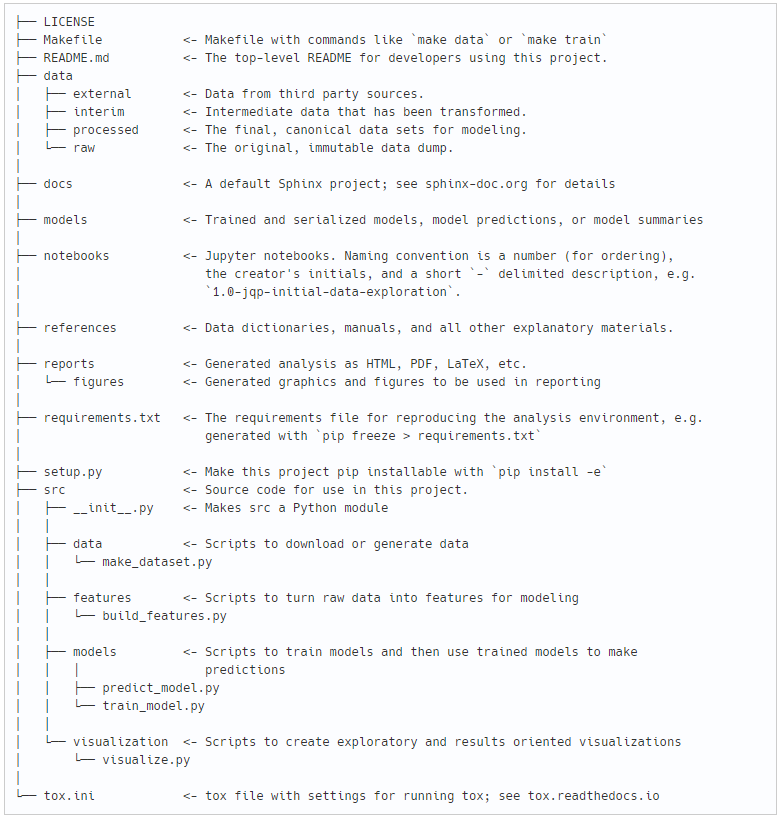

# DataContest 2020, задача №5 "Определение основных принципов анализа и типологизации финансовых моделей деятельности ВУЗов"

## Постановка задачи
Проект выполнялся в рамках конкурса DataContest https://data-contest.ru. 

Цель - на основании анализа планов финансово-хозяйственной деятельности и финансовой отчетности проанализировать и типологизировать финансовые модели деятельности организаций высшего образования.

Подробнее https://github.com/Corporate-Accelerator-GenerationS/DataContest/issues/5

## Источники данных
- Реестр организаций, осуществляющих образовательную деятельность по аккредитованным образовательным программам http://obrnadzor.gov.ru/ru/opendata/7701537808-RAOO/
- Официальный сайт для размещения информации о государственных (муниципальных) учреждениях https://bus.gov.ru

## Основные этапы
1. Загрузка данных
2. Очистка данных
3. Вычисление корреляции финансовых показателей
4. Анализ аномальных значений
5. Масштабирование данных
6. Кластерный анализ
7. Интерпретация результатов

## Структура проекта
В соответствии с http://drivendata.github.io/cookiecutter-data-science/

